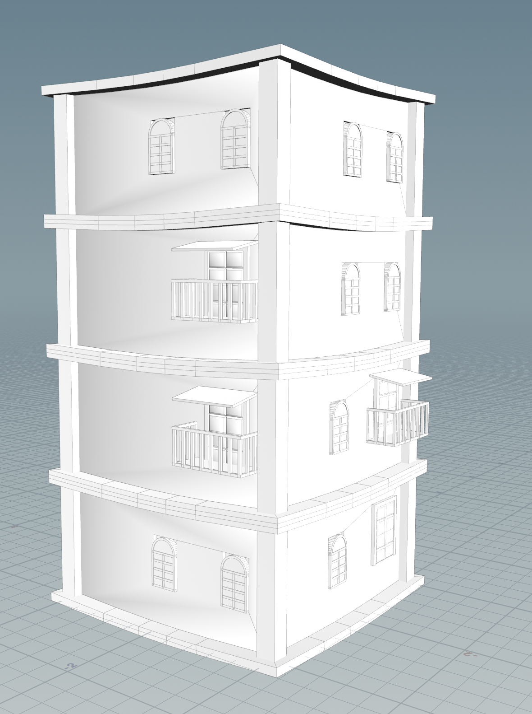
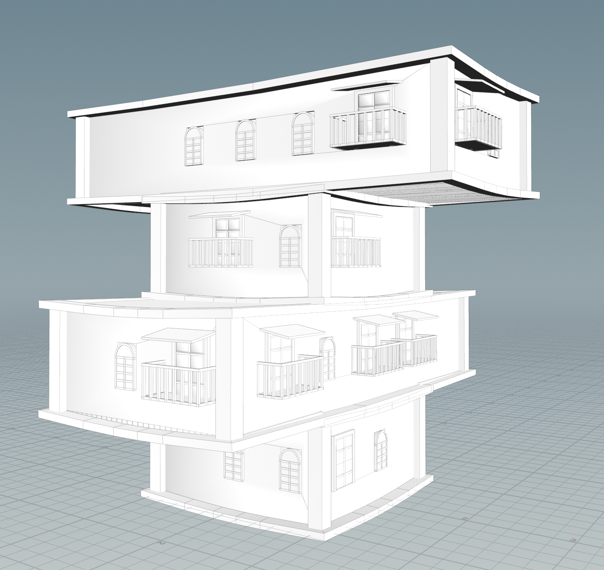
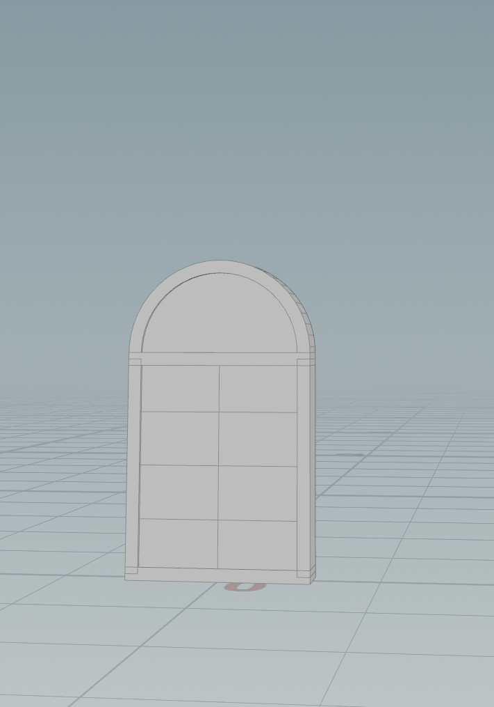
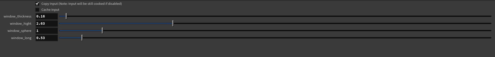
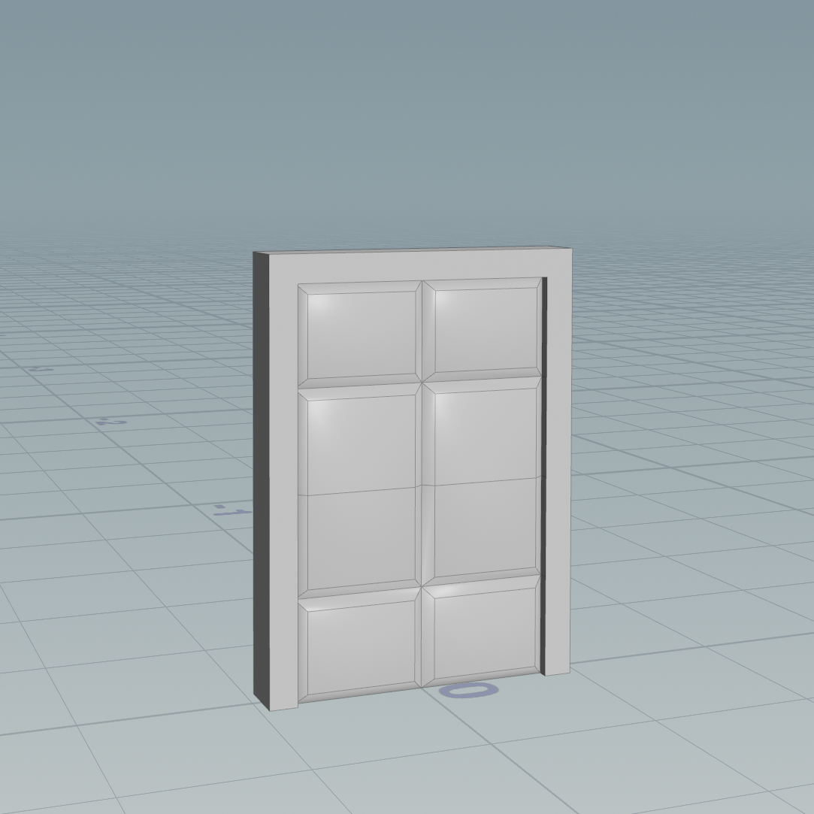
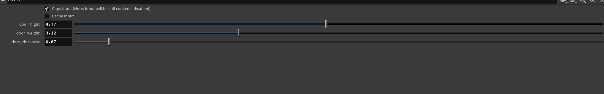
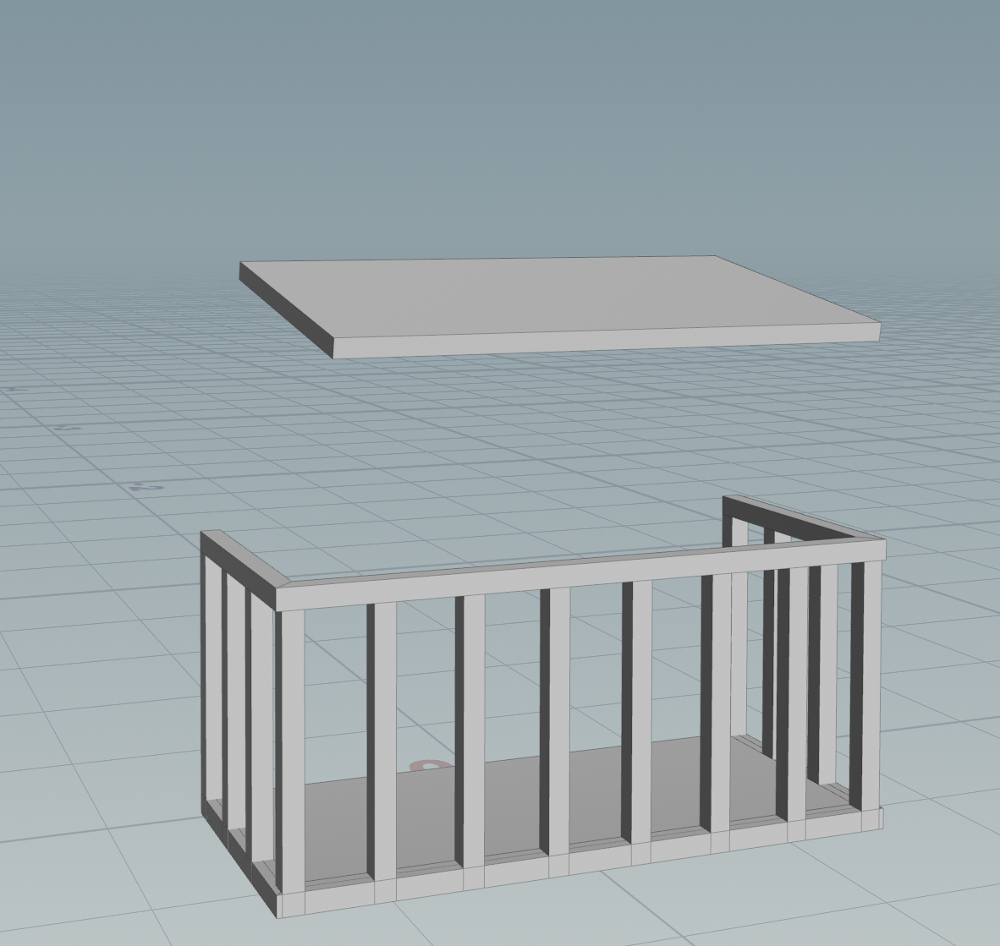
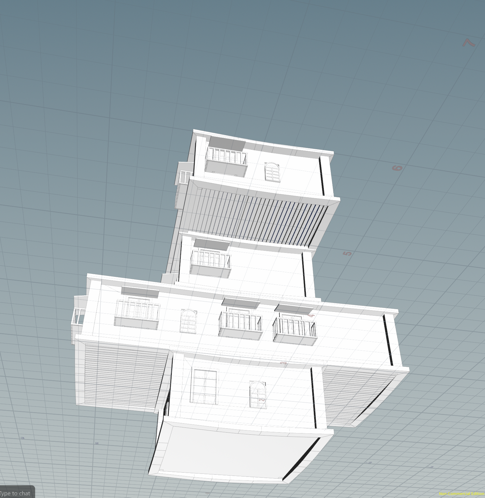

# Houdini Procedural Buildings

## Project Overview
In this homework you’ll gain more experience with tool creation and loops. The core of this homework will be following a Procedural House tutorial to create a multi-floor building generator. The tutorial is linked here: 
https://www.youtube.com/watch?v=uIe97023sDk&t=979s&ab_channel=SimonHoudini 

Following are my inspiration

.jpg)

.jpg)

.jpg)

The main element of the this type of building, from overwatch Havana map, are arc doors/windows, unsymetric side and front, symetrix on the same side, and each level has balcony.

For the assets required might be arc door/windows, arc roof, balcony wireframe, support stick between layers, and flowers/plants.

## 🏙️ Final Result
The final procedural building can be adjusted in real-time — changing the number of floors, dimensions, or proportions will automatically regenerate the entire structure.  

**Final Model:**  

---

## 🧱 Components and Parameters

### 🪟 Window 
**Parameters:**
- `window_thickness`  
- `window_height`  
- `window_sphere` (arc radius control)  
- `window_long` (horizontal length)  

Generates an arched window with variable curvature, thickness, and proportions.  

**Result:**  

---

### 🚪 Door
**Parameters:**
- `door_height`  
- `door_weight`  
- `door_thickness`  

Creates paneled doors with adjustable size and depth.  

**Result:**  

---

### 🏢 Balcony 
**Parameters:**
- `height`  
- `NO` (bar count / density)  
- `weight`  
- `deep`  

Produces a modular balcony railing and floor unit that can be attached to any building face.  

**Result:**  

---

---
### 🏢 Support Beam

---
## 🏗️ Building Assembly
The building is generated by stacking and offsetting multiple floors using **Copy and Transform SOPs** with parameterized translations to distribute floors evenly.  
Each floor procedurally attaches windows, doors, and balconies based on rules set within a master HDA.

## ⚙️ Technical Notes
- All HDAs are **embedded** within the `.hip` file.  
- Each module is parameterized and can be reused in different procedural setups.  
- Constructed entirely with Houdini’s procedural modeling tools — no external assets.  

---